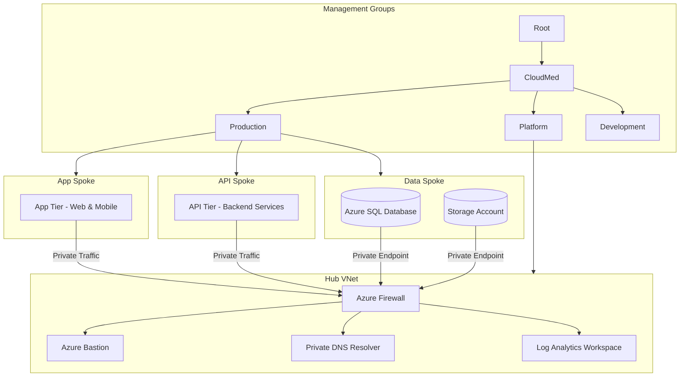

# Lab 10: CloudMed Zero Trust Azure Landing Zone Design

## 1. Company Overview

CloudMed Solutions Inc. is a healthcare technology company that provides cloud-based telemedicine and patient-management platforms to hospitals and clinics across **Canada**, the **United States**, and **Europe**.  
Its main product, **MedConnect**, includes:

- Secure telehealth sessions  
- Electronic medical record (EMR) management  
- AI-driven health analytics  

Because CloudMed handles sensitive health data, it must comply with **HIPAA**, **GDPR**, and **PIPEDA**.  
Workloads are deployed in **Canada Central** and **West Europe** to meet performance and regulatory needs.

### Why Zero Trust?

CloudMed must adopt Zero Trust to:

- Authenticate and authorize every access attempt  
- Apply least-privilege access to users and services  
- Segment networks to contain potential breaches  
- Enforce compliance and protect patient data  

### Key Drivers

- Mandatory compliance (HIPAA, GDPR, PIPEDA)  
- Need for centralized governance and consistency  
- High monitoring and incident-response requirements  
- Global operations requiring secure scalability  

---

## 2. Governance and Identity

### Management Group Hierarchy

### Governance Model

**RBAC (Role-Based Access Control)**  
- **Admins** → Full control in Platform  
- **DevOps** → Contributor roles in Development, restricted permissions in Production  
- **Finance** → Reader + Cost Management roles  

**Azure Policies**  
- Mandatory tags: Environment, Owner, CostCenter  
- Allowed regions: Canada Central, West Europe  
- Deny public IPs on PaaS services  
- Enforce encryption for SQL and Storage  
- Naming convention standards  

**Identity Security (Azure Entra ID)**  
- Conditional Access (MFA + compliant device + trusted location)  
- Passwordless authentication (FIDO2 keys)  
- Privileged Identity Management (PIM) for Just-In-Time access  

---

## 3. Network Architecture

CloudMed follows a **Hub-and-Spoke** architecture aligned with Zero Trust.

### Hub (Shared Services)

- **Azure Firewall Premium** for centralized inspection  
- **Azure Bastion** for secure VM administration  
- **Private DNS Resolver** for internal name resolution  
- **Log Analytics Workspace** for centralized monitoring  
- **Azure Monitor Agent (AMA)** for unified telemetry  

### Spokes (Application Workloads)

| Spoke        | Description                | Security Controls                          |
|--------------|----------------------------|---------------------------------------------|
| **App Tier** | Web + Mobile frontends     | WAF, NSGs, private subnets                  |
| **API Tier** | Backend microservices      | Private Link, strict NSGs                   |
| **Data Tier**| Azure SQL + Storage        | Private Endpoints, encryption, no public IP |

### East–West Traffic Control

- All inter-spoke communication flows through **Azure Firewall**  
- Subnets isolated using NSGs  
- Custom UDRs enforce firewall routing  

### Private Connectivity

- **Private Endpoints** for SQL + Storage  
- No public network access for data tier  
- App and API tiers communicate through private IPs only  

---

## 4. Zero Trust Controls

### 1. Verify Explicitly

- Strong Azure Entra authentication  
- MFA, Conditional Access, compliant devices  
- Workload identities for API-to-API communication  

### 2. Use Least Privilege Access

- Minimal RBAC scope  
- PIM for Just-In-Time (JIT) elevation  
- Bastion-only access - no direct RDP/SSH from the internet  

### 3. Assume Breach

- Segmentation with Hub-and-Spoke architecture  
- Encryption: SQL TDE, Storage SSE  
- Defender for Cloud + Sentinel for threat detection  
- Policy blocking public endpoints and enforcing secure defaults  

### Key Design Examples

1. Azure Bastion for secure admin access  
2. SQL Private Link to remove public exposure  
3. "Deny Public IP" Azure Policy  
4. NSG separation between App, API, and DB tiers  
5. Centralized logs via Log Analytics + Defender  

---

## 5. Monitoring, Compliance, and Cost Management

### Monitoring

- **Azure Monitor** for metrics and alerts  
- **Log Analytics Workspace** for logs  
- **Microsoft Defender for Cloud** for workload protection  
- **Microsoft Sentinel** for SIEM/SOAR  

### Compliance

- Azure Policy for tagging, region restriction, encryption  
- Compliance dashboard measuring HIPAA/GDPR/PIPEDA alignment  
- Log retention in Storage for audits  

### Cost Management

- Azure Budgets + cost alerts  
- Cost-center tagging  
- Savings Plans + Reserved Instances for predictable workloads  

---

## 6. Conceptual Architecture Diagram

---

## 7. Summary and Recommendations

### Design Summary

This Landing Zone design follows the **Azure Landing Zone (ALZ)** architecture and applies Zero Trust across identity, networking, governance, and monitoring.

It delivers:

- **Security:** MFA, Conditional Access, segmentation, private endpoints  
- **Compliance:** Azure Policies aligned with HIPAA, GDPR, PIPEDA  
- **Scalability:** Modular management groups + repeatable spokes  

### Recommendations for Future Improvement

#### 1. Cost Optimization with Reservations & Savings Plans

CloudMed can reduce compute and DB costs by **65–72%** using:

- Azure SQL Reservations  
- VM Reservations  
- Azure Savings Plans  

#### 2. Adoption of Azure Virtual Network Manager (AVNM)

AVNM would allow CloudMed to:

- Standardize network rules globally  
- Enforce security admin rules  
- Simplify routing and peering at scale  

---

