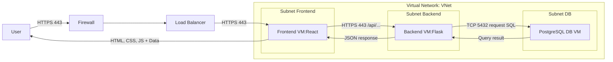
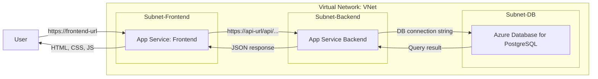

# CST8913 Lab2 report

## 1. Description IaaS deployment:

In IaaS, we deploy the React frontend and Flask backend on virtual machines. We manage the OS and runtimes ourselves. A load balancer can distribute traffic to multiple app VMs. The Postgres database runs on its own VM in a private subnet. Security groups/firewalls control inbound ports (443 for web, 5432 for DB).

## 2. Description PaaS deployment:

In PaaS, we deploy React to a Static Web App service (which builds and serves static files automatically), Flask to an App Service (with dependencies installed from requirements.txt), and Azure Database to manage a Postgres database service. After deployment, each service receives its own URL or endpoint. The browser uses the frontend URL to load the application, which then calls the API URL for backend services. The backend, in turn, connects to the database through the connection string. The cloud platform manages runtimes, patching, scaling, and backups automatically.

## 3. IaaS Deployment Diagram:
**Diagram:**

    In IaaS, we deploy the React frontend, Flask backend, and PostgreSQL database on separate virtual machines connected through a virtual network. A load balancer distributes HTTPS traffic from users to the frontend and backend. The backend VM queries the database VM privately on port 5432. Security groups/firewalls restrict traffic to port 443 for web access and port 5432 for database access,

## 4. PaaS Deployment Diagram:

**Diagram:**

    In PaaS, we deploy React to a Static Web App service, Flask to an App Service, and PostgreSQL to a managed database service. After deployment, each service receives its own URL. The browser loads the frontend URL, the frontend calls the API URL, and the backend connects to the database using the connection string. The cloud platform manages runtimes, patching, scaling, and backups automatically.

 