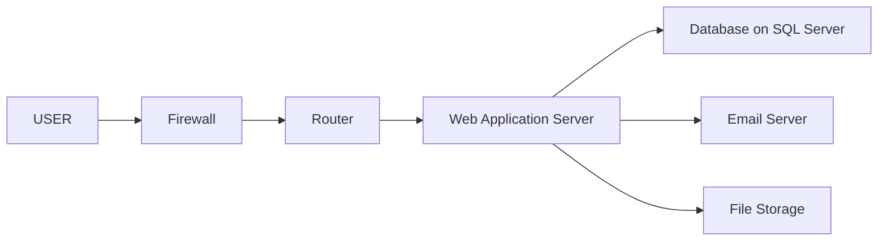
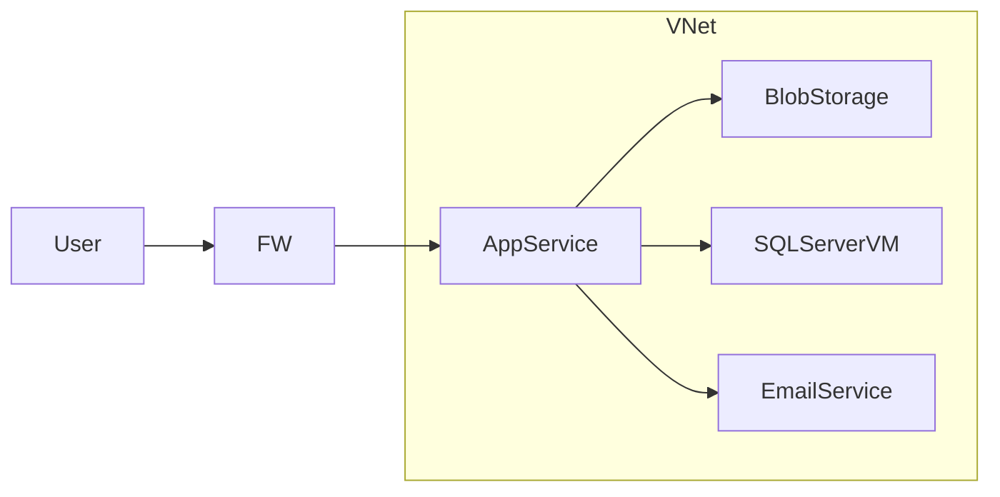

# Lab3 - Advanced Concept

## Section 1: On-Premises Solution Design

## 1. On-premises architucter:

## 2. On-premises description solution

The organization runs a monolithic web application that is hosted inside a physical infrastructure. This architecture consists of:

- **Firewall:** Manages ports to protect the internal network from external attacks  
- **Router:** Handles networking traffic and works as a gateway for requests  
- **Web application server:** Hosts and runs the web application and responds to user requests  
  - **Dependencies:** Directly connects to the SQL database, local file system, and email server  
- **SQL database server:** Stores data and responds to server queries  
  - **Dependencies:** Web application server  
- **File storage:** Uses the server’s local disk or a directly attached storage volume  
  - **Dependencies:** Web application server  
- **Email server:** An internal email server, such as Microsoft Exchange  
  - **Dependencies:** Web application server  
  
  # 3. Component Mapping to Cloud Service Models

- Web Application → PaaS 

- Database → PaaS 

- File Storage → PaaS

- Networking → IaaS

- Email service → SaaS 

## Section 2: Migration Strategies

## 1. Migration strategies:

- **Web Application**

   IaaS (Rehost): Lift-and-shift to cloud VMs - no code changes, manage OS/patches

   PaaS (Replatform): Deploy to Azure App Service- minimal config changes, automated scaling

- **Database**

   IaaS (Rehost): Database on cloud VMs - full control, self-manage backups

   PaaS (Replatform): Managed database service - automated backups

- **File Storage**

   IaaS: Managed file shares Azure Files - drive mapping, minimal changes

   PaaS (Refactor): Object storage Azure Blobs -  cloud-native scalability

- **Networking**

   Cloud-native replacement: Software-defined networking VNet with security groups

- **Email Service**

   IaaS : Email servers on VMs 

   PaaS/SaaS (Repurchase): Managed email services (SendGrid/M365) - fully managed SMTP

   #Migration Plan

   ## 2. PaaS architucture diagram:

# 3. Hybrid Migration Plan:

## Web Application
- **Target Service:** PaaS (Azure App Service)  
- **Strategy:** Replatform  
- **Reasoning:** Keeps current architecture while leveraging auto-scaling, managed patches, and reduced operational overhead.  

## Database
- **Target Service:** IaaS (SQL Server on Azure VM)  
- **Strategy:** Rehost (Lift and Shift)  
- **Reasoning:** Provides full control of operations and backups. Hybrid step before modernizing to PaaS later.  

## File Storage
- **Target Service:** PaaS (Azure Blob Storage)  
- **Strategy:** Replatform  
- **Reasoning:** Enables cloud-native scalability and durability compared to local disk storage.  

## Networking
- **Target Service:** Cloud-native networking (Azure VNet + NSG)  
- **Strategy:** Cloud-native replacement  
- **Reasoning:** Provides secure, software-defined networking with better isolation and scalability.  

## Email Service
- **Target Service:** SaaS (Microsoft 365 / SendGrid)  
- **Strategy:** Repurchase  
- **Reasoning:** Fully managed service, reduces complexity of maintaining internal email servers.  

