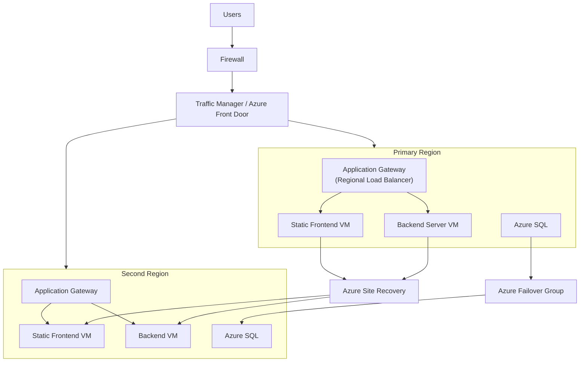

# Lab 04 - Design Rehosting Migration V1

## 1. solution diagram 

## 2. Target Architecture

Global Access: Users connect through Firewall → Azure Front Door / Traffic Manager, which directs traffic to the healthiest region.

Primary Region:

Static frontend VM + backend VM serve the app.

Azure SQL (primary) stores data.

Azure Site Recovery replicates VMs to the secondary region.

Azure SQL Failover Group replicates DB to the secondary region.

Secondary Region:

Contains replicated frontend and backend VMs.

Hosts a read-only Azure SQL until promoted during failover.

Redundancy & Failover

Traffic routing redundancy: Front Door/Traffic Manager automatically shifts traffic if primary region is down.

Compute redundancy: VMs are replicated via Azure Site Recovery for disaster recovery.

Database redundancy: Azure SQL Failover Groups provide automatic DB promotion to secondary.

## 3. Migration Steps

Preparation (Lift and Shift)

Separate the backend application servers from the SQL database.

Deploy backend/front-end VMs in Azure.

Move the SQL database into Azure SQL to allow cross-region replication.

VM Replication

Use Azure Site Recovery to replicate frontend and backend VMs from the primary region to the secondary region.

This ensures compute resources can be quickly brought online during a failover.

Database Replication & Failover

Enable Azure SQL Failover Groups for automatic geo-replication.

This keeps a read-only secondary copy in sync, ready to be promoted in case of primary DB failure.

Traffic Routing & Load Balancing

Configure Azure Front Door (or Traffic Manager) to monitor application health across regions.

Traffic is automatically routed to the healthiest/available region.